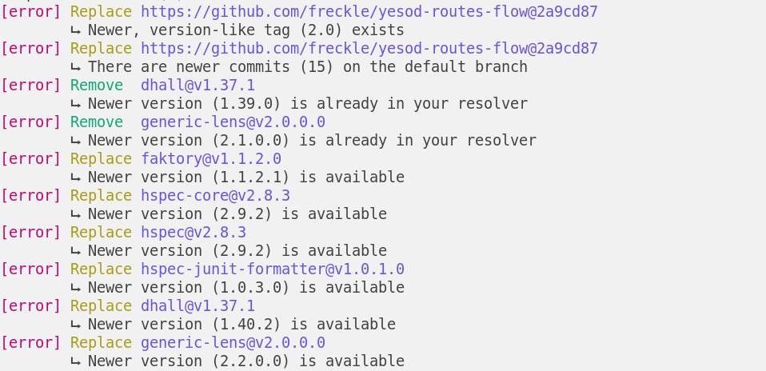
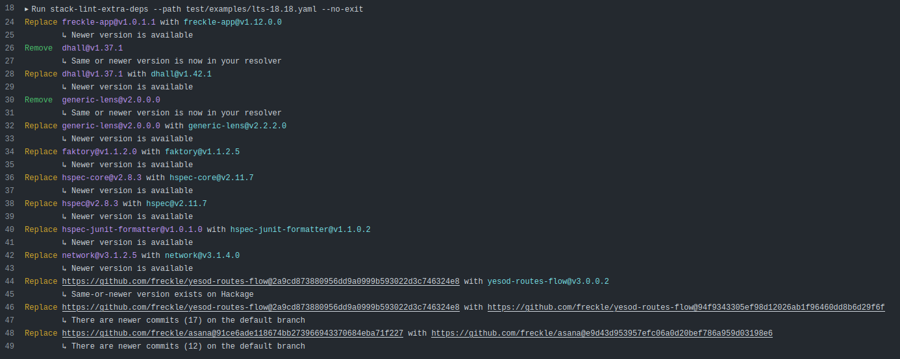
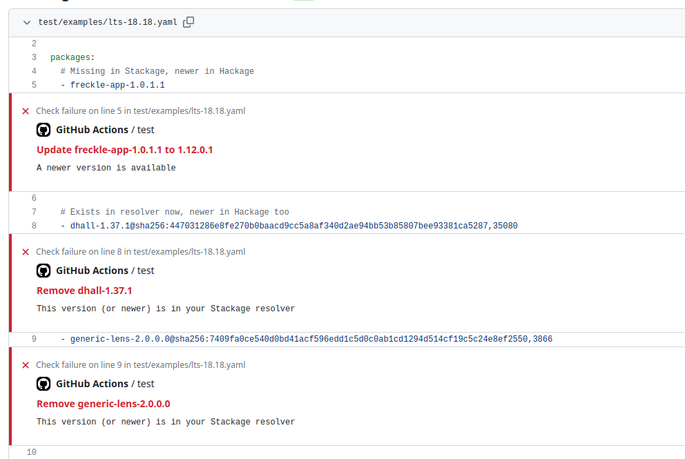

# Lint `extra-deps`

Maintaining `extra-deps` in a `stack.yaml` (or `packages` in a `snapshot.yaml`)
is a pain. If an extra dep has been moved into your resolver, you should remove
it. If your extra dep has a new version on Hackage, you may want to update it.
If you have a `git` dependency, you may want to know if that change is now
available in a versioned release on Hackage.

All of these are manual, annoying, and error prone to check by hand.



## Install

Get the Download URL for the latest release,

```sh
url=$(curl --silent https://api.github.com/repos/freckle/stack-lint-extra-deps/releases/latest |
  jq '.assets[].browser_download_url | select(.|test("x86_64-linux.tar.gz$"))' --raw-output)
```

(You can also just browse [Releases][].)

[releases]: https://github.com/freckle/stack-lint-extra-deps/releases

```console
% curl -L "$url" | tar xzf - &&
  mv stack-lint-extra-deps/stack-lint-extra-deps ~/.local/bin &&
  rmdir stack-lint-extra-deps
% which stack-lint-extra-deps
~/.local/bin/stack-lint-extra-deps
```

## Usage

```console
% stack lint-extra-deps --help
Usage: stack-lint-extra-deps [-p|--path PATH] [-r|--resolver RESOLVER]
                             [-f|--format tty|gha|json] [--exclude PATTERN]
                             [-R|--no-check-resolver] [--checks CHECKS]
                             [-n|--no-exit] [-F|--fix] [PATTERN] [--version]

  stack lint-extra-deps (sled)

Available options:
  -p,--path PATH           Path to config to lint
  -r,--resolver RESOLVER   Resolver to use, default is read from --path
  -f,--format tty|gha|json Format to output in
  --exclude PATTERN        Exclude deps matching PATTERN
  -R,--no-check-resolver   Don't check for out of date resolver
  --checks CHECKS          Checks to run, one of: none, all, git, hackage
  -n,--no-exit             Exit successfully, even if suggestions found
  -F,--fix                 Automatically fix problems
  PATTERN                  Limit to deps matching PATTERN
  --version                Print version number information and quit
  -h,--help                Show this help text
```

Our output uses [Blammo][] and so [any of the `LOG_` environment
variables][blammo-config] it supports may be used to control it, such as
`LOG_COLOR`.

[blammo]: https:/github.com/freckle/blammo#readme
[blammo-config]: https://github.com/freckle/blammo#configuration

## Pragmas

Comments prefixed by `@sled ` (e.g. "pragmas") can be added to the linted file
and will be parsed as command-line options to change the program's behavior when
linting that file. This is most useful for centralizing and documenting
`--exclude` directives:

```yaml
resolver: lts-20
extra-deps:
  - one-dep-1.0

  # We need to hold this back because...
  # @sled --exclude another-dep
  - another-dep-2.0
```

These comments can appear anywhere. All options besides `--path` will be
respected. Failure to parse a directive will result in a warning logged to
`stderr`, but otherwise be ignored.

## Checking Resolver

Before checking `extra-deps`, SLED will check that your `resolver` is the latest
in its series. If not, it will emit a "replace with" suggestion and use the new
resolver when checking the `extra-deps`.

This behavior is not part of the `--checks` option, which refers to `extra-deps`
checks only. It can be disabled with `--no-check-resolver`, or you can run
_only_ this check by using `--checks none`.

## GitHub Action

This repository is also a GitHub Action that installs and runs the tool with no
arguments (so with all defaults according to above). The `version` and
`arguments` can be adjusted through inputs:

```yaml
steps:
  - uses: actions/checkout@v4
  - uses: freckle/stack-lint-extra-deps@v1
    with:
      version: 1.0.1.6
      arguments: >-
        --path stack-x.yaml
        --exclude 'amazonka-*'
        --checks hackage
        --no-exit
```



### Action Version

Version branches (e.g. `@v1`) are unrelated to the tool's version itself (and
corresponding tags). They are maintained based on changes made only to the
action itself.

### Annotations

Since `v1.2` (of the executable, not the action), `--format gha` is available
and will result in output that produces annotations in your workflow summary.



In the future, this may become part of the default `arguments`, but for now you
are expected to add it yourself if desired.

## Features

- [x] Suggest update when there is a newer version of a Hackage dep available
- [x] Suggest removal when a Hackage dep is in the resolver at a same-or-newer
      version
- [x] Suggest update when there are newer commits in a git dep
- [x] Suggest replacement when there is a Hackage version of a git dep at a
      same-or-newer version
- [ ] Apply custom rules
- [x] Suggest when newer resolver is available
- [x] Auto-fix

## Release

To trigger a new release, push a [conventional commit] to `main`:

- `fix:` to trigger a patch release
- `feat:` to trigger a minor release
- Use `<type>!:` or include a `BREAKING CHANGE: <change>` footer to trigger
  major

[conventional commit]: https://www.conventionalcommits.org/en/v1.0.0/#summary

---

[LICENSE](./LICENSE) | [CHANGELOG](./CHANGELOG.md)
