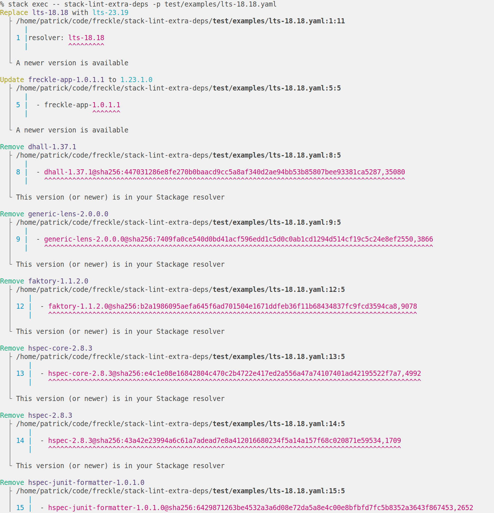

# Lint Stackage (extra) Deps

Maintaining `extra-deps` in a `stack.yaml` (or `packages` in a `snapshot.yaml`)
is a pain. If an extra dep has been moved into your resolver, you should remove
it. If your extra dep has a new version on Hackage, you may want to update it.
If you have a `git` dependency, you may want to know if that change is now
available in a versioned release on Hackage.

All of these are manual, annoying, and error prone to check by hand.



## Usage

```console
Usage: lsd [-r|--resolver ARG] [--exclude ARG] [--checks ARG] [-f|--format ARG]
           [--no-exit] [--cache-dir ARG] [--no-cache] [-c|--color ARG]
           [-v|--verbose] [PATH]
  Lint Stackage (extra) Deps

Available options:
  -r,--resolver ARG        Override resolver from stack.yaml
  --exclude ARG            Exclude deps by glob
  --checks ARG             Checks to run, one of all, git, hackage
  -f,--format ARG          Output format, one of detailed
  --no-exit                Exit successfully even if suggestions found
  --cache-dir ARG          Overide cache directory, default follows XDG
                           (default: "/home/patrick/.cache/lsd")
  --no-cache               Ignore caches
  -c,--color ARG           When to use color: auto, always, never
  -v,--verbose             Log verbosely
  PATH                     Path to config to lint (default: "stack.yaml")
  -h,--help                Show this help text
```

## Workflow

This is intended for use as part of a "Resolver Bump", when moving a project
from one Stackage resolver to a (presumably) newer one. After doing so, run this
linter. It will suggest any changes to your `extra-deps` that apply under the
new resolver (such as redundant Hackage deps).

## Features

- [x] Suggest update when there is a newer version of a Hackage dep available
- [x] Suggest removal when a Hackage dep is in the resolver at a same-or-newer
      version
- [ ] Confirm all Hackage `extra-deps` use sha-pinning
- [x] Suggest update when there are newer commits in a git dep
- [x] Suggest replacement when there is a Hackage version of a git dep at a
      same-or-newer version*
- [ ] Apply custom rules

\*For now we just look for a same-or-newer, version-like tag in the repository.
We don't yet confirm they exist on Hackage.

---

[LICENSE](./LICENSE) | [CHANGELOG](./CHANGELOG.md)
